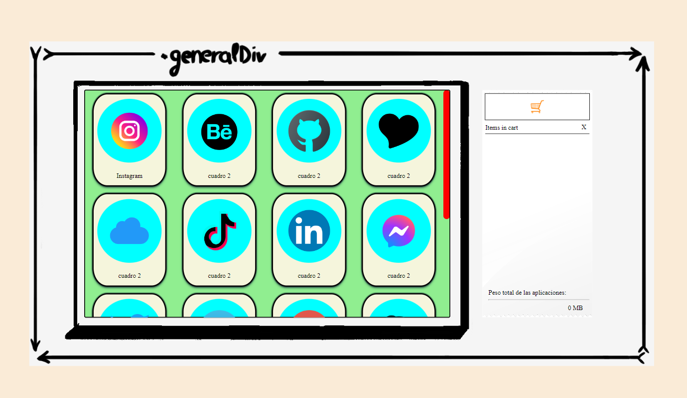

<!-- PROJECT LOGO -->

  

<h3 align="center">Carrito JS Vanilla</h3>

  

    Un carrito e-commerce simple hecho desde 0 en JS vanilla 
     
     
     
    <a href="https://github.com/github_username/repo_name">Prueba la aplicación</a>
    ·
    <a href="https://github.com/github_username/repo_name/issues">Reporta un Bug</a>
  

<!-- ABOUT THE PROJECT -->
## Sobre el proyecto

A modo de proyecto final, este proyecto se basa en la incorporación del evento ondrag() de JavaScript y contabilizar los _items_ que arrastremos, con temática de libre elección. Una vez realizada esa tarea, añadí los extras que a mi me interesaban. 

En cuanto a la temática, ideé una por cuenta propia que trata de una tienda de aplicaciones, que, al ser arrastradas al carrito, se sumará su peso total en MB (o GB si pasa de 1024MB)

### Built With

* ![Javascript]
* ![html]
* ![css]

<!-- USAGE EXAMPLES -->
## Uso de la aplicación

La tienda se reparte en dos lados:
- **Izquierda**: se sitúan la tienda y la lista de los items, que podremos desplazar mediante un _scroll bar_. De ahi empezaremos a arrastrar la imagen de la app hacia el carrito.
 
- **Derecha**: se encuentra el "recibo", dentro del cual tendremos el carrito donde dejaremos caer los _items_, la lista de estos que hemos añadido al carrito con su respectiva cantidad, una cruz para vaciar el carrito, y el computo total del peso de todas las aplicaciones.

Para probarla, simplemente arrastraremos la imagen de la aplicación que querremos añadir al carrito hacia el icono del carrito. 

## Planes de futuro

Tengo en mente unos retoques para hacer en un futuro:

- **Mostrar** mediante un destello el **valor** (peso) del **objeto** (app) que hemos soltado al carrito
 
- **Boton de vaciado individual** para cada objeto de la lista
 
- Permitir que un **usuario** pueda **añadir objetos** a la lista y establecerles un valor

## Contacto

Para cualquier otra pregunta que no se ha podido aclarar en las previas secciones, sientete libre de contactar conmigo a través de las siguientes plataformas:

- Email: ma.holiszowski@gmail.com
- [Github](https://github.com/Mikiexe)

<!-- MARKDOWN LINKS & IMAGES -->

[Javascript]: https://img.shields.io/badge/Javascript-FF2D20?style=for-the-badge&logo=javascript&logoColor=white
[html]: https://img.shields.io/badge/HTML-blue?style=for-the-badge
[css]: https://img.shields.io/badge/CSS-orange?style=for-the-badge

[github]: https://github.com/Mikiexe
